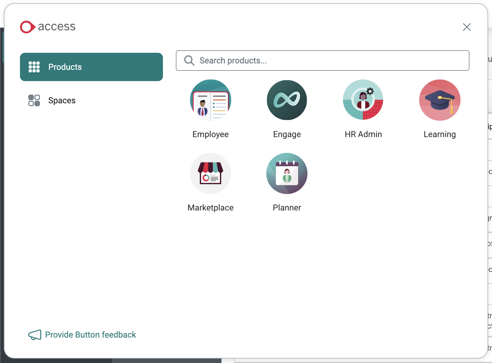

People HR App Setup Instructions
===

To install the People HR app you must first create an API key. Head over your People HR account to get started.

Once you've logged in, click "Settings" at the bottom left of the screen and choose "API"

Click "Generate a new API key" and choose the next permissions:

__Employee:__
* Get All Employee Detail
* Get Training Detail By Employee Id
* Get Employee Late Detail
* Get Benefit By Employee Id
* Get Qualification By Employee Id

__Salary:__
* Get Salary Detail

__Holiday:__
* Get Holiday Detail

__Document:__
* Get all documents

Click "Save" and copy your new API key to your clipboard. Keep this token private, safe and secure.

When you install the People HR app in Deskpro, enter this API key into the settings tab of the app.

To configure who can see and use the People HR app, head to the "Permissions" tab and select those users and/or groups you'd like to have access.

When you're happy, click "Install".
